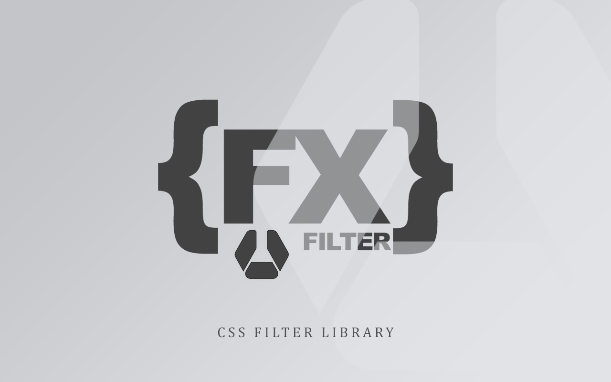
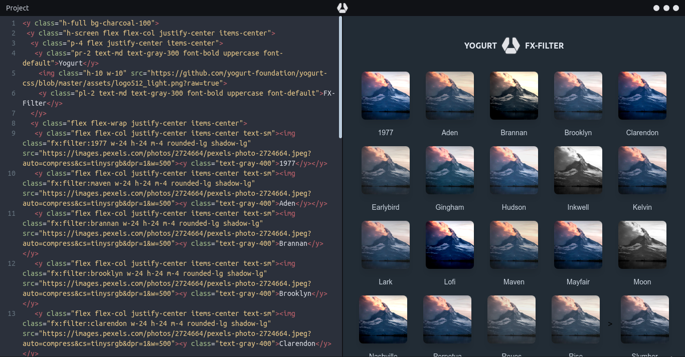

<p align="center">
  
</p>

<p align="left">
  <a href="https://discord.gg/jEaq55" 
     target="_blank">
    
  </a>
  
  
  
  
  
  
  
  
  
  
  
  
  
  
</p>

> A complete set of CSS filters utility for web UI, (FX, aka `Special Effect`).

### See [FX-Filter Previewer](https://fx-filter-previewer.netlify.com/).

Yogurt `{FX}.filter` started out as a small side-project of mine. As I was increasingly using CSS animations and filters, I thought it would come in handy to have them organized in a meaningful and accessible way so that they can be easily reused on different projects.

I have been using `{FX}.filter` for a while now and I hope some of you will find it useful as well. It is still very much a work in progress and hopefully it will evolve over the time.

Below are my special collection of css filter made by me over the years.

---

#### {filter}

> **(!!)** this preset has completed

- 1977, aden, brannan, brooklyn, clarendon, earlybird, gingham, hudson, inkwell, kelvin, lark, lofi, maven, mayfair, moon, nashville, perpetua, reyes, rise, slumber, stinson, toaster, valencia, walden, willow, xpro2

> (total) 26 modules, 26 effects

---

<p align="left">
  
</p>

## _manage

you can `enable` or `disable` the `modules` that you don't want to included in the build with **comment out** them to suite your need,

- to customize presets, look for file `fx-filter.scss`.
- to customize modules, look for file `_modules.scss`.

---

## _introduction

> **(!!)** there are so much to do to make the class name easy to use.

the class name is always start with a prefix `fx:filter:`, following with the effect name e.g. `lofi`.

## _usage

let's take an example of **{filter}** preset pack that comes with **{lofi}** effect module, this add filter to the image,

```html


<figure class="fx:filter:lofi">
  
</figure>
```

see all effect modules in [all presets](https://github.com/loouislow81/fx.css/wiki).

---

## _using via cdn

```html
<link defer href="https://unpkg.com/fx-filter@1.0.0/dist/fx-filter.css" 
      rel="stylesheet"
      rel="preload"
      as="style"
      media="all">
```

## _using via build

``` bash
# install dependencies
$ npm install

# build for production
$ npm run build
```

---

[MIT](https://github.com/yogurt-foundation/fx-filter/blob/master/LICENSE)


